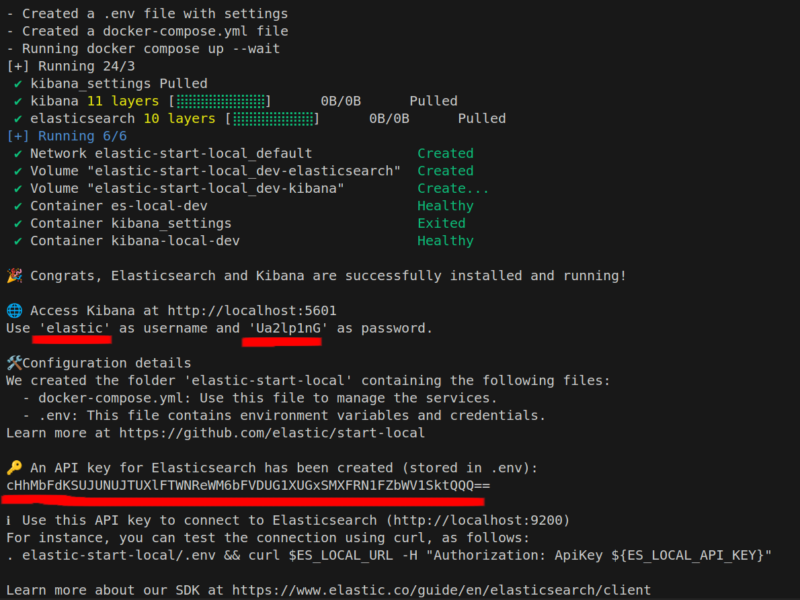

# Lecture code snippets

I will use this file to mention installation requirements for lecture demos and also any code snippets that I will be copy/pasting during the lecture demo.

## Wed, Mar 19 (Data Pipeline):

- In your VM, install Snowflake connector. You should already have pandas and matplotlib installed, but just in case you provisioned a new VM, I am listing those as well.
```
pip install snowflake-connector-python pandas matplotlib
```

## Wed, Mar 5 (ElasticSearch):

## Upgrade your VM to e2-medium 
- Stop and remove all running `docker` containers.
- Remove all extra/unnecessary data files. You can always redownload when you want to review those topics.
- We'll continue to have disk size as 25GB.
- Here's a helpful [tutorial](https://cloud.google.com/compute/docs/instances/changing-machine-type-of-stopped-instance) to upgrade your existing VM.
- **IMPORTANT**: It is very important that you go through this step first before you go through the installation for ElasticSearch. Otherwise, the installation might fail!

## Setting up ElasticSearch using Docker

**Note** Developing in VS Code is way easier! (The extension: Remote-SSH is a life saver). Please consider switching to VS code instead of 10 floating terminals.

- In your VM, install Elastisearch and Kibana (with docker):
```bash
curl -fsSL https://elastic.co/start-local | sh
```

**This command will give you a password and an API key as shown below. Store both.**



- To restart your container, cd into `elastic-search-local`: 
```bash
docker stop es-local-dev
cd elastic-start-local
docker compose up -d
```

Sometimes you have to remove the elastic-start-local dir and start from scratch (container state becomes unhealthy when you re-start your VM sometimes)

- [Optional] Sanity check your elasticsearch connection. In your VM:
```bash
cd elastic-start-local
source .env
curl $ES_LOCAL_URL -H "Authorization: ApiKey ${ES_LOCAL_API_KEY}"
```

---

## Setting up `jupyter` and `python elasticsearch-client`

- Install `elasticsearch` so we can interact with elasticsearch via Python.

```bash
pip3 install elasticsearch
```


## Wed, Feb 19 (MongoDB):

#### Installations on your VM:

```
pip3 install jupyter pandas nbformat nbconvert
pip3 install pymongo 
pip3 install geopandas matplotlib
```

#### Docker clean up

```
docker system prune
docker rm `docker ps -aq`
docker rmi -f `docker images -aq` (force removes stale images)
```
```
docker pull mongo
docker run --name <container-name> -d -p 127.0.0.1:27017:27017 mongo
```
```
docker exec -it <CONTAINER NAME> bash
```

--------------------------------

## Mon, Feb 3 (MySQL):

#### Installations on your VM:

Optional: Stop your VM, refresh your window after a few minutes, and “Start / Resume” to update kernel version

``` 
sudo apt-get update
sudo apt-get install python3-pip wget unzip
```
```
sudo pip3 install jupyter
pip3 install SQLAlchemy mysql-connector-python pandas
pip3 install pandas
```

#### Docker clean up

```
docker system prune
docker rm `docker ps -aq`
docker rmi -f `docker images -aq` (force removes stale images)
```
```
docker pull mysql
docker run -d -m "1g" -p 127.0.0.1:3306:3306 -e MYSQL_DATABASE=cs639 -e MYSQL_ROOT_PASSWORD=abc mysql
```
```
docker exec -it \<CONTAINER NAME\> bash
```

```
mysql -p cs639
help
show tables;

git pull (inside your s25 directory)
# Note: navigate to today's lecture directory within your s25 directory
jupyter notebook
```

#### Establish ssh tunnel (from your laptop to your VM):

**IMPORTANT NOTE:** You need to open a new terminal / powershell tab on your laptop to establish this ssh tunnel.

```
ssh USER@<IP> -L localhost:8888:localhost:8888
```
