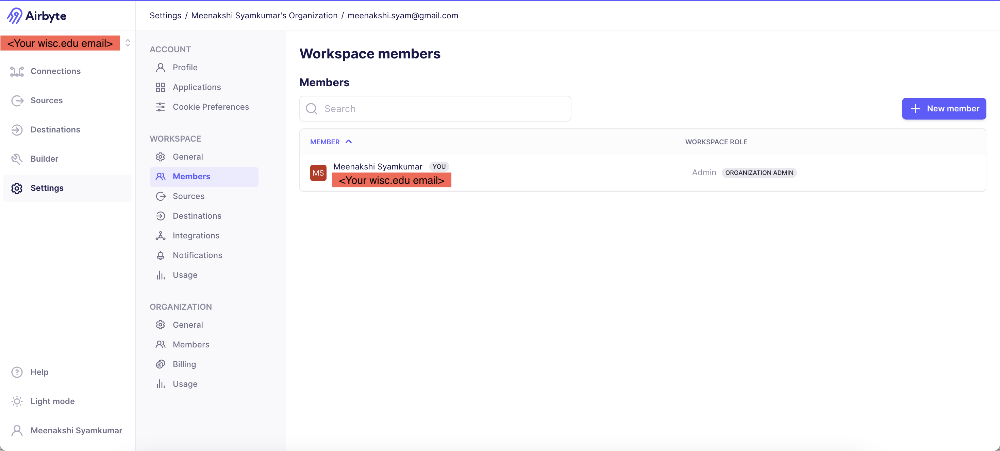
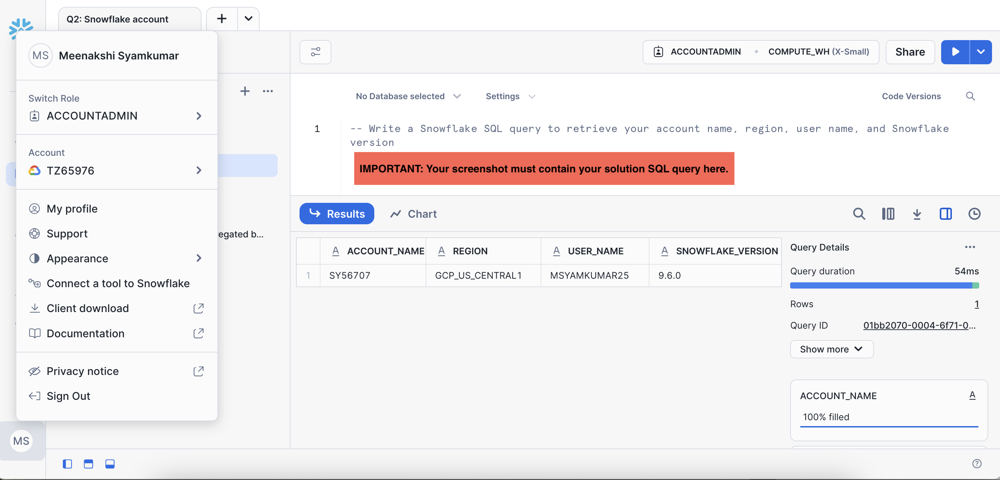
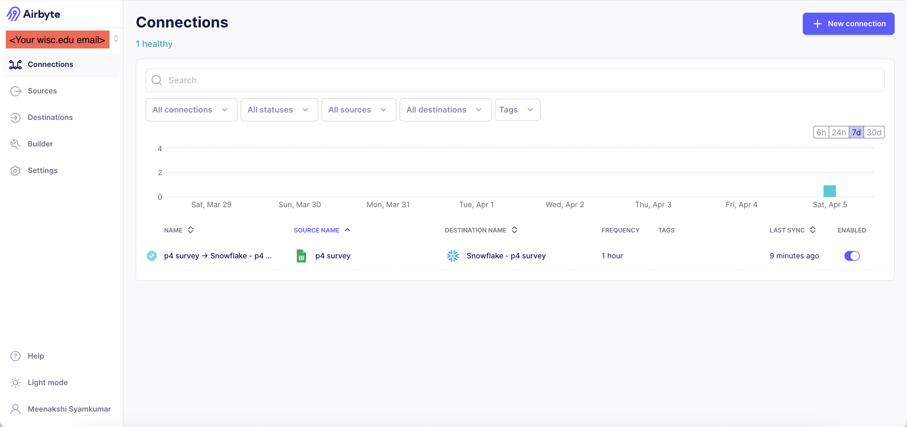
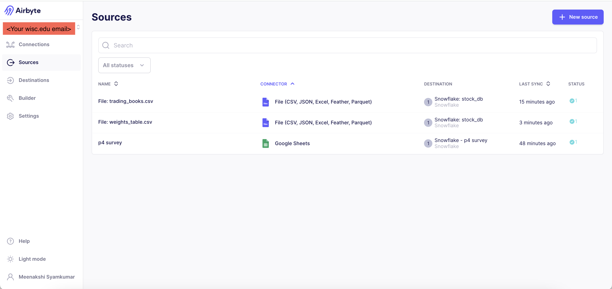
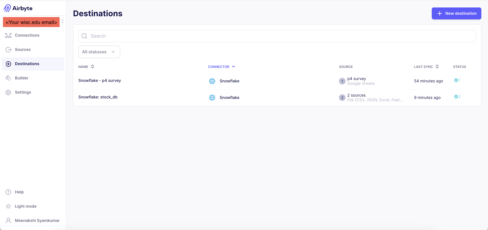
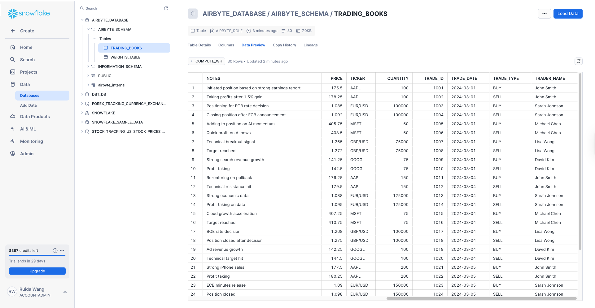
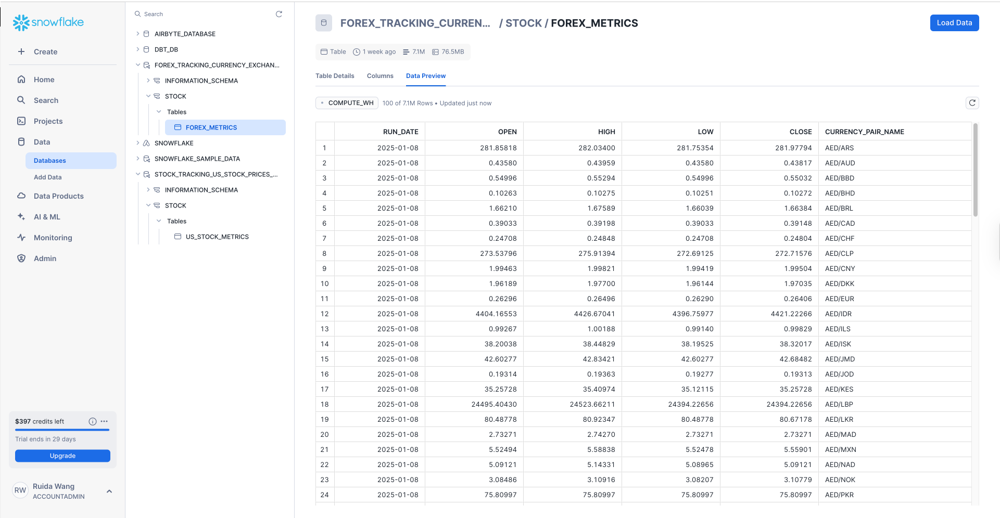
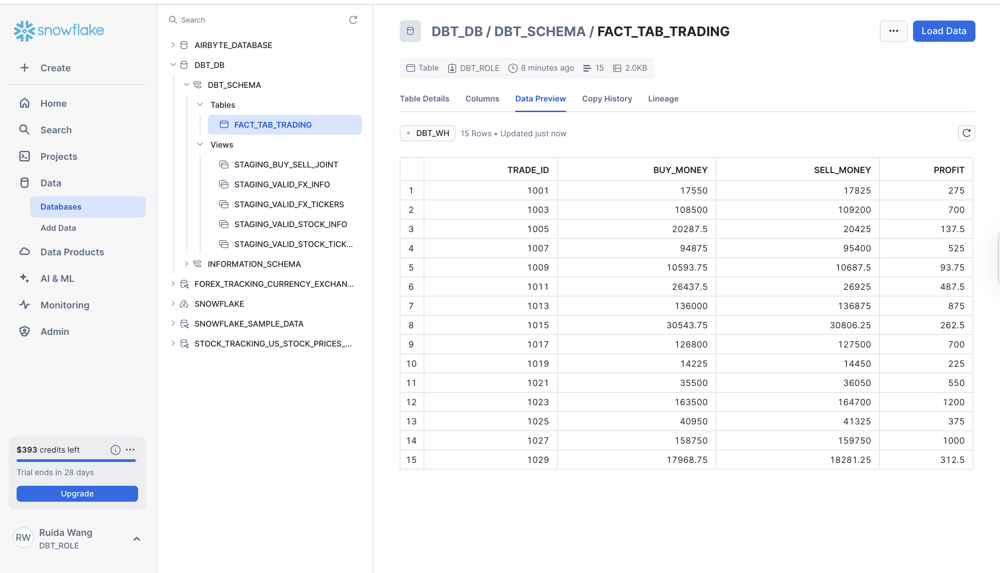

# P4 (8% of grade): ELT data pipeline - Airbyte, Snowflake, and DBT

## Clarifications / fixes
- [3/22 2:45AM] Fixed github classroom link issue.
- [3/22 7:30AM] Adding warning about Snowflake login requirements, specifically not to hardcode password in `p4.ipynb`.
- [3/31 11:03 AM] Fixing Q10 to Q16 (was originally mistyped as Q18) in IMPORTANT note mentioned in the section.
- [3/31 11:07 AM] Adding a note to Q10 to Q16 about survey data.
- [3/31 11:11 AM] Adding a note to Q6 about using github URL in the source configuration.
- [3/31 11:19 AM] Fixing numbering and missing step in Q4 and updating corresponding step's point.
- [3/31 11:42 AM] Adding clarification to Q21 on how to determine valid tickers.
- [3/31 12:46 PM] Fixing name to schema.yml reference in Q9. We'll accept both schema.yml and survey_schema.yml file names (file name doesn't really matter). Just make sure to use one of those options.
- [4/01 2:51 PM] Adding more details about valid ticker determination for Q21.
- [4/01 9:46 PM] Correcting mistake with Q7 (should be 2 destinations and not 3). Both csv files should go to single destination. If you configured 3 destinations, we'll accept that as well.
- [4/01 10:07 PM] Fixing copy/paste error with Q18. Submission requirements previously incorrectly stated to display transform_survey.sql.
- [4/02 10:11 PM] Fixing Q19 to remove "second" source. You'll need to add multiple sources for the STOCK_DB tables.
- [4/02 12:08 PM] Adding more clarifications to Q21.
- [4/02 10:43 PM] Clarifying transform_survey versus survey_transformed in Q9.


## :telescope: Overview

In this project, you will get familiar with the ELT (Extract, Load, and Transform) pipeline for data analysis. Using Airbyte to extract and load data to Snowflake, then use DBT to perform transformation. Then, use Snowflake SQL for data analysis. You'll be working with a custom student generated dataset. In addition, you'll use stock and foreign exchange (fx) datasets. 

Learning Objective:

- Gain hands-on experience in setting up Airbyte, Snowflake, and dbt to create a modern data pipeline for data analysis.
- Master the integration of Airbyte, Snowflake, and dbt to streamline data extraction, transformation, and loading (ELT) workflows.
- Develop expertise in configuring and managing Snowflake, including connecting to Snowflake Marketplace and transforming data with dbt models.
- Understand how to clean and preprocess raw data using dbt for effective analysis, including renaming columns and creating views.
- Apply SQL to create staging tables and fact tables.

⚠️ Please use Piazza to post (public/private) any questions regarding this project, as e-mails will NOT be answered. If you need to include your code to get help, please make a private post.

## :outbox_tray: Submission requirements

Github classroom link: [https://classroom.github.com/a/6EsW9IyB](https://classroom.github.com/a/6EsW9IyB)

- The submission repository should include a pdf report, which can be generated either from a word document or using Latex (eg: Overleaf). The report should include all the relevant screenshots and the code as mentioned in the corresponding sections of this project write-up. 
- You will also include a notebook file with relevant code for some questions. Make sure to name the file as `p4.ipynb`.
- You will also include a `files` directory that will contain csv files from your dbt transformation process. 
- Appropriate details are provided for each question.

⚠️ **IMPORTANT**: 
- Even if you have a project partner, please make sure to submit individual reports, but add your partner information to the top of your report. You may collaborate extensively with your project partner, but each of you must create your own data pipelines individually.
- The sample screenshots provided uses a personal email. Please make sure to create your accounts using your wisc.edu email.
- Airbyte has a 14-day trial period. Due to upcoming Spring Break, if you would like access to the Airbyte account until the project deadline, we would recommend doing your first sync on Saturday, March 22nd. The first sync initiates the 14-day trial period.

## :hammer_and_wrench: Section 1: Setup environment (15 points in total)

#### Q1: Register Airbyte Account (0.5 points)

We will use the web version of Airbyte for this project. You need to register an [Airbyte account](https://airbyte.com/) and claim your 14-day free trial for Airbyte using your wisc email. We will use Airbyte to extract and load most of our data to Snowflake.

⚠️ **IMPORTANT**: 
- Airbyte has a 14-day trial period. Due to upcoming Spring Break, if you would like access to the Airbyte account until the project deadline, we would recommend doing your first sync on Saturday, March 26th. The first sync initiates the 14-day trial period.

:outbox_tray: To get credit for this question include the screenshot of `Settings > Workspace > Members` in your submitted report. The example screenshot is as follows:



#### Q2: Register Snowflake Account (0.5 points)

Snowflake is a cloud-based data platform that provides scalable storage, high-performance analytics, and secure data sharing. It is widely used in the industry for data warehousing, business intelligence, and big data processing. We will guide you to get some hands-on experience with Snowflake. Firstly, you need to register a [Snowflake account](https://www.snowflake.com/en/). You'll have a 30-day free trial and $400 credits.

:outbox_tray: To get credit for this question:
- You need to write a Snowflake SQL query to retrieve your account name, region, user name, and Snowflake version.
- Make sure to name the resultant columns as `account_name`, `region`, `user_name`, and `snowflake_version`.
- After executing the query, make sure to click on your account details and provide a screenshot that shows your account information, your Snowflake SQL query and the query's output. The example screenshot is as follows:



#### Q3: Install DBT using Miniconda (0.5 points)

dbt (Data Build Tool) is an open-source command-line tool used by data teams to transform raw data into a clean, analytical format within a data warehouse. It enables data analysts and engineers to build, test, and document data models through SQL scripts. 

- All of the following installations will be in your GCP VM. Make sure that you bring down the elasticsearch docker cluster. If you run into disk space issues, please make sure to delete unnecessary files. 
- First install miniconda following the instruction [here](https://www.anaconda.com/docs/getting-started/miniconda/install#macos-linux-installation). Go ahead and enter "yes" for this question "Do you wish to update your shell profile to automatically initialize conda?".
- Then create a miniconda env named `p4-env` using `conda create -n p4-env python=3.10`. All the packages will be installed in the new envs and will not interrupt your base env. It will be very useful when you are having multiple projects on your VM.
- Make sure to close your ssh session and open a new session.
- Then activate your conda environment using `conda activate p4-env`.
- Finally, install the required modules
```
pip install snowflake-connector-python dbt-snowflake dbt-core pandas matplotlib
```

:outbox_tray: To get credit for this question:
- You need to create a new notebook file named `p4.ipynb`.
- Then create a new markdown cell to identify Q3 (feel free to copy paste the format from this README file).
- In a new cell, execute the `which dbt` command using the appropriate syntax to run linux commands.

#### Q4: Snowflake configuration (6.5 points - 0.5 point for each step)

⚠️ **IMPORTANT**: 
- If any of your configuration names are different from the below mentioned list, you will lose points.
- You must have at least three transactions in your SQL worksheet. Otherwise you'll points. 

On your Snowflake, create a new SQL worksheet and name the worksheet as `p4` to write the following SQL queries. Make sure to split the steps into appropriate transactions - you can take inspiration from the example that we covered during the lecture. 

1. Write a SQL query to switch to use `accountadmin` role.
 - If you do this step manually, you'll lose points.
2. Create a warehouse named `P4_WAREHOUSE` using `xsmall` as warehouse size.
 - Make sure to include `if not exists` clause.
 - Make sure to use all the cost saving options: suspend the warehouse after 60 minutes of inactivity, initially suspend the warehouse after creation, and make sure to resume the warehouse automatically on query execution.
 - Optionally, you may define appropriate variables for all the names in this configuration (good practice to do that). You'll not lose points if you don't define variables.
3. Create two databases named `SURVEY_DATABASE` and `STOCK_DB`.
 - Make sure to include `if not exists` clause.
4. Create a role named `P4_ROLE` (1 point for this step).
 - Make sure to include `if not exists` clause.
 - **NEW UPDATE**: Granting `P4_ROLE` to the SYSADMIN role.
5. Grant usage on the warehouse `P4_WAREHOUSE` to the `P4_ROLE`.
6. Grant the role `P4_ROLE` to your Snowflake user (username should be your Snowflake username).
7. Grant ownership of `SURVEY_DATABASE` and `STOCK_DB` to `P4_ROLE`.
8. Switch to `P4_ROLE`.
9. Create a schema in `SURVEY_DATABASE` named `SURVEY_SCHEMA`.
 - For step 10 and 11, you need to either run the `USE DATABASE ...` and then run the create query or use the `<database>.<schema>` notation directly with your create query. Both answers are acceptable.
 - Make sure to include `if not exists` clause.
10. Create a schema in `STOCK_DB` named `STOCK_SCHEMA`.
11. Grant ownership of `SURVEY_SCHEMA` to `P4_role`.
12. Grant ownership of `STOCK_SCHEMA` to `P4_role`.

:outbox_tray: To get credit for this question:
- paste the SQL code for this step into your report document
- make sure to write the question description as the title for the corresponding section

#### Q5: Airbyte configuration for survey (1.5 points)

⚠️ **IMPORTANT**: 
- If you haven't already filled out P4 survey google form, please fill out before you complete this question.
- P4 survey google form would also count for participation credits
  
Configure an Airbyte connection with this google sheet source: [https://docs.google.com/spreadsheets/d/1EOykPOCrZB_l0wNlPSDpIC_JAWBRHRNofPJKyyooxV8/edit?usp=sharing](https://docs.google.com/spreadsheets/d/1EOykPOCrZB_l0wNlPSDpIC_JAWBRHRNofPJKyyooxV8/edit?usp=sharing) and Snowflake as destination. Your destination configuration for this survey connection should use appropriate configurations you made in Q4. For example: `SURVEY_DATABASE`, `SURVEY_SCHEMA`, etc.,. Email column should be the primary key and make sure enable "Convert Column Names to SQL-Compliant Format".

:outbox_tray: To get credit for this question include the screenshot of your Airbyte `Connections` page in your submitted report. The example screenshot is as follows:



#### Q6: Airbyte configuration for `trading_books.csv` and `weights_table.csv` files (0.5 points)

In the process of data analysis, it is common to use your private data that are not pre-configured in any of the data markets. Airbyte provides a method to load your private CSV file to the database for analysis. In this project, we will use the `trading_books.csv` and `weights_table.csv` files in https://github.com/Snowflake-Labs/sfguide-deploying-pipelines-with-snowflake-and-dbt-labs/tree/main/dbt_project/seeds for analysis. Set up the source in Airbyte by using `File` in Sources.

**Note**: If you are trying to configure the source directly using the github URL, you must use the raw version, that is your URL should not be github.com, instead it should be raw.githubusercontent.com.

:outbox_tray: To get credit for this question, you are required to include the screenshot of your `Sources` section in the Airbyte in the report. The sources should contain two extractions of `Files`. You should also clearly show the `e-mail` and `name` of your account in the screenshot. The example screenshot is as follows:



**Note**: Your screenshot will include 3 sources unlike this example screenshot. We'll be updating this screenshot sometime soon.

#### Q7: Connect Airbyte to Snowflake to load `trading_books` and `weights_table` (0.5 points)

Set up another Airbyte connection to Snowflake. The relevant documentation should pop up directly in Airbyte. Just in case, you can find the documentation [here](https://docs.airbyte.com/integrations/destinations/snowflake?_gl=1*6fqg41*_gcl_aw*R0NMLjE3Mjk1MjI4MTEuQ2owS0NRanc5OWU0QmhEaUFSSXNBSVNFN1BfYWZuTEtHN3BlUWxlbmZXOW14Q0otaXRwWG0zV0xsM1pjeGpjQWt6bE9sQS1oNTFZODE5a2FBc3lIRUFMd193Y0I.*_gcl_au*NzUxMzA5NTcyLjE3MjkwMDUxMzUuMzk0OTIyMjM4LjE3MzAzMTIyMDEuMTczMDMxMjcyMQ..). You need to set `Trade_id` in `trading_books` and `Region` in `weights_table` as the primary keys.

:outbox_tray: To get credit for this question, you are required to include the screenshot of the page `Destinations` in Airbyte WebUI in your submitted report, the connection should be healthy. You should also clearly show the `e-mail` and `name` of your account in the screenshot. The example screenshot is as follows:


**Note**: Your screenshot will include 2 (**new note**: this should be 2 and not 3) destinations unlike this example screenshot. We'll be updating this screenshot sometime soon.

#### Q8: Data Preview on Snowflake (0.5 points)

After loading all the relevant data into Snowflake, take screenshots of the `Data Preview` section of Snowflake for **all three datasets** (i.e., there should be three screenshots for this question) and add the screenshots your report. Your screenshot should include at least part of your name (bottom left corner). The example screenshot is as follows:



**Note**: Your screenshot should contain correct configurations from Q4.  We'll be updating this screenshot sometime soon.

#### Q9: Use dbt to transform the column names to single word or two-word names with "_" separator and create a view named `transform_survey`. (4 points)

- You must transform all the original survey column names except for `TIMESTAMP` using dbt sql file named `transform_survey.sql`.
- If you haven't already created the `.dbt` directory in your home directory, go ahead and create that.
- Create `~/.dbt/profiles.yml` with the project name as `p4_data_pipeline`.
- `cd` into your home directory.
- Then run the `dbt init p4_data_pipeline` command.
- `cd` into `p4_data_pipeline` directory and create `models/schema.yml`.
- Create a directory named `staging` inside the `models` directory.
- Finally, create `transform_survey.sql` inside `models/staging` and run `dbt debug`, `dbt run`.

:outbox_tray: To get credit for this question:
- In `p4.ipynb`, create a new markdown cell to identify Q9 (feel free to copy paste the format from this README file).
- In a new cell, execute the appropriate linux command to display the contents of `~/.dbt/profiles.yml` and ⚠️ **IMPORTANT** filter out the line containing `password`. **Hint:** We covered the linux command that enables this filtering at the beginning of this semester. You'll lose points if your output contains your password and you'll have to reset your Snowflake account password because all of us in the staff team will have access to it!
- In a new cell, execute the appropriate linux command to display `models/schema.yml`.
- In a new cell, execute the appropriate linux command to display the content of `models/staging/transform_survey.sql`.
- In your report:
 - include a screenshot showing `Data Preview` of the view that you created using the dbt transformation.
- **NEW NOTE** the previous version of the question incorrectly referenced the view name as `survey_transformed`. That was meant to be `transform_survey`. We'll accept screenshots with either naming terminology for both the sql file and the view.

## :building_construction: Section 2: Custom student dataset analysis (7 points in total)

#### Q10 to Q16 (1 point each)

So far, we have come up with data analysis questions for you. Let's have you get experience coming up both with analysis questions and answers for them.

⚠️ **IMPORTANT**: 
- While it is tempting to use generative AI to generate the data analysis questions for you, this would be a concrete example of generative AI platforms taking away your learning. So, please come up with questions on your own. Usage of generative AI platform for any part of Q10 to Q16 will be considered violation of course rules.
- You are **not required** to wait for all students to fill out the survey to finish these questions. You are **not required** to update your answers to these questions after the survey deadline. 
- **Do not** hardcode your Snowflake password into `p4.ipynb`. Make sure to store the password in a file and read it directly from the file. Example code can be found in `Snowflake_intro.ipynb` inside data transformation lecture code directory.

:outbox_tray: To get full credit for these questions:
- In `p4.ipynb`, write the question number and the question description using markdown format.
- Solve the question using appropriate SQL query.
- At least one of the analysis questions should involve usage of `GROUP BY` clause.
- At least two of the analysis questions should create plots using `matplotlib`. For example, pie charts, bar plots, line plots, etc.,

## :building_construction: Section 3: Stock and foreign exchange (fx) dataset analysis (7 points in total)

#### Q17: Ingest data directly from Snowflake Marketplace (0.5 points)

It is a common practice to combine your private data with open-source datasets to perform data analysis. Snowfalke provides a large collection of data products for you to do that. In particular, this project will use `Forex Tracking: Currency Exchange Rates by Day` and `Stock Tracking: US Stock Prices by Day` as the public data sources. You can find them in Snowflake `Data Products > Marketplace`.

:outbox_tray: To get credit for this question, add **two screenshots** of the `Data Preview` of `US_STOCK_METRICS` (stock data) and `FOREX_METRICS` (fx data) in your report. Your screenshot should include at least part of your name (bottom left corner). The example screenshot is as follows:



#### Q18: Configure `~/.dbt/profiles.yml` for `STOCK_DB` (0.5 points)

Update your `~/.dbt/profiles.yml` to create a new output named `stock_db`. 

:outbox_tray: To get credit for this question:
- In `p4.ipynb`, create a new markdown cell to identify Q20 (feel free to copy paste the format from this README file).
- In a new cell, execute the appropriate linux command to display the contents of `~/.dbt/profiles.yml` and ⚠️ **IMPORTANT** filter out the line containing `password`. **Hint:** We covered the linux command that enables this filtering at the beginning of this semester. You'll lose points if your output contains your password and you'll have to reset your Snowflake account password because all of us in the staff team will have access to it!

After all these steps, you can create staging tables and marts tables using dbt. 

#### Q19: Update `models/schema.yml` file to include new sources for `STOCK_DB` tables (0.5 points)

You should set the stock data soource name as `stock_by_day`, fx data source name as `fx_by_day`, and the Airbyte extracted data as `airbyte_csv_data`. Stock data should include `US_STOCK_METRICS` table, FX data should include `FOREX_METRICS` table, and  airbyte data should include `TRADING_BOOKS` & `WEIGHTS_TABLE`. **NEW NOTE**: You'll have four sources after this step for each of the following: survey (whatever name you defined for it - we din't impose any names), stock_by_day, fx_by_day, csv source (whatever name you defined for it - we didn't impose any names for this either). 

:outbox_tray: To get credit for this question:
- In `p4.ipynb`, create a new markdown cell to identify Q19 (feel free to copy paste the format from this README file).
- In a new cell, execute the appropriate linux command to display `models/schema.yml`.

#### Q20: Create `dbt_project.yml` file in your dbt project directory --- `p4_data_pipeline` (0.5 points)

Configure `dbt_project.yml` inside your dbt project folder. In `models`, you need to add two subsections, namely `staging` (intermediate tables for the transformation process), which is materialized as `view` and `marts` (final version for analysis), which is materialized as `table`. Both sections should use `P4_WAREHOUSE` as the snowflake warehouse. In models, you should also create another directory named `marts` to deploy the model.

Then, you can set up dependencies in the file `packages.yml` (should be created inside the main dbt project directory --- `p4_data_pipeline`) by adding version `1.1.1` of `dbt_utils`. Then, you can install the packages by running `dbt deps`.

:outbox_tray: To get credit for this question:
- In `p4.ipynb`, create a new markdown cell to identify Q22 (feel free to copy paste the format from this README file).
- In a new cell, execute the appropriate linux command to display `dbt_project.yml`.

#### Q21: Creating staging tables for FX and Stock (1 point)

The original stock and fx trading tables are huge and contains a lot of irrelevant information. Thus, the first stage to transform data is to select the data we need from `TRADING_BOOKS` table.

You need to first create two staging views that selects all dates and valid tickers that we have separately into two tables, one named `staging_valid_fx_tickers` and another named `staging_valid_stock_tickers` for the FX and stock data. **NEW NOTE**: Valid ticker information for both FX and stock should be generated from `TRADING_BOOKS` table. A ticker is valid if it is present in `TRADING_BOOKS`. For the purpose of this tranformation process, you can consider that stock information comes from `Equity Desk` and forex (fx) information comes from `FX Desk`. You need to write appropriate SQL queries to filter the corresponding unique ticker-date combinations to generate the two staging tables. 

<details>
  <summary>
    Hint:
  </summary>
  <p>You don't need to write a complex query to solve this question. DISTINCT can be used on multiple columns. </p>
</details>

Subsequently, you need to find the open, close, high, and low prices for the selected tickers and dates in tables named `staging_valid_stock_info` and `staging_valid_fx_info`. **NEW NOTE**: Your SQL query for generating the info tables must use the corresponding `staging_valid_<type>_tickers` tables --- this where your selected tickers are. Make sure to include ticker name and date columns as well along with open, close, high, and low prices. Data doesn't always come in a clean format --- in the `FOREX_METRICS` you need to figure out which column represents the ticker information by looking through the data.

**NEW NOTE** - while executing the `dbt run` command, you need to specify the target using `--target` option. You could also use `--select` option to specifically execute one of the sql files. Here is the [dbt documentation](https://docs.getdbt.com/reference/node-selection/syntax) for it.

:outbox_tray: To get credit for this question:
- Display your code for `staging_valid_fx_tickers.sql`, `staging_valid_stock_tickers.sql`   `staging_valid_stock_info.sql`, and `staging_valid_fx_info.sql` by using appropriate linux command inside `p4.ipynb`.
- Create a `files` dictory inside your repository.
- Also, download the content of the transformed tables as CSV files named  `staging_valid_fx_tickers.csv`, `staging_valid_stock_tickers.csv`, `staging_valid_stock_info.csv`, and `staging_valid_fx_info.csv` in the `files` directory of your repo.

#### Q22: Create staging table for trading pairs (0.5 points)

The `TRADING_BOOKS` table records every transaction of `BUY` and `SELL`. Although each `BUY` record is associated with another `SELL` record. It is not merged together in the `TRADING_BOOKS` table. We need to create a staging table to record that. The data has the following constraint: every trader can only make exactly one buy, and the trader must sell on the same day of the buy. Your staging table should be named as `staging_buy_sell_joint`.

Based on the above constraints, create a staging file that includes:

1. `Trade_id` of buy trade
2. `Trade_date`
3. `Trader_name`
4. `Desk`
5. `Ticker`
6. `Quantity_buy` that records the quantity of the buy transaction
7. `Price_buy` that records the buying price
8. `Quantity_sell` that records the quantity of the sell transaction
9. `Price_sell` that records the selling price

It should be ordered by `Trade_id` of the buy trade.

:outbox_tray: To get credit for this question:
- Display your code for `staging_buy_sell_joint.sql` by using appropriate linux command inside `p4.ipynb`.
- Also, download the content of the transformed tables as a CSV file named `staging_buy_sell_joint.csv` in the `files` directory of your repo.

#### Q23: Create a fact Table for trading data (1.5 points)

This question asks you to create a fact table for trading data. You should write the table creation script in the `marts` directory within the `models` directory, rather than in the `staging` directory, because this query is intended to create a table, not a view. A table is a persistent object in the database, whereas a view is a virtual object that executes the underlying query each time it is referenced. Your fact table should include the following columns:

1. `Trad_id` of the buy trade
2. `Buy_money` that records the total buy price (`price_buy * quantity_buy`)
3. `Sell_money` that records the total selling price (`price_sell * quantity_sell`)
4. `Profit` that records the profit of this trade

The result table should be ordered by `Trade_id`. You are recommended to use the staging tables just created.

:outbox_tray: To get credit for this question:
- Display your code for `fact_tab_trading.sql` by using appropriate linux command inside `p4.ipynb`.
- Also, download the content of the transformed tables as a CSV file named `fact_tab_trading.csv` in the `files` directory of your repo.
- You need to include a single screenshot of your Snowflake `Data Preview` that shows the views and tables you just created in your report. Your name should also be clearly shown on the screenshot. An example screenshot is shown as follows. 



#### Q24: Compute total profit by desk (1 point)

In this question, you should SQL query to calculate the total profit by desk. Your SQL query's output should look like this:

| Desk   | total_profit |
| ------ | ------------ |
| Equity |              |
| FX     |              |

<details>
  <summary>
    Hint:
  </summary>
  The data that you need are inside `TRADING_BOOKS` and `FACT_TAB_TRADING`.
</details>

:outbox_tray: To get credit for this question:
- You need to write the SQL query inside `p4.ipynb` and show the output of the query after you execute it.

#### Q25: Compute profit rate by desk (1 point)

In this question, you are required to write an SQL query to calculate the total profit rate for each desk. The profit rate is defined as the difference between total sell money and total buy money, divided by the total buy money. Your query should aggregate the data by desk and handle potential division by zero errors.

Your SQL query's output should look like this:

| Desk   | Total profit |
| ------ | ------------ |
| Equity |              |
| FX     |              |

:outbox_tray: To get credit for this question:
- You need to write the SQL query inside `p4.ipynb` and show the output of the query after you execute it.

## :outbox_tray: Submission requirement (Repeating this once again)

Github classroom link: [https://classroom.github.com/a/6EsW9IyB](https://classroom.github.com/a/6EsW9IyB)

- The submission repository should include a pdf report, which can be generated either from a word document or using Latex (eg: Overleaf). The report should include all the relevant screenshots and the code as mentioned in the corresponding sections of this project write-up. 
- You will also include a notebook file with relevant code for some questions. Make sure to name the file as `p4.ipynb`.
- You will also include a `files` directory that will contain csv files from your dbt transformation process. 
- Appropriate details are provided for each question.
